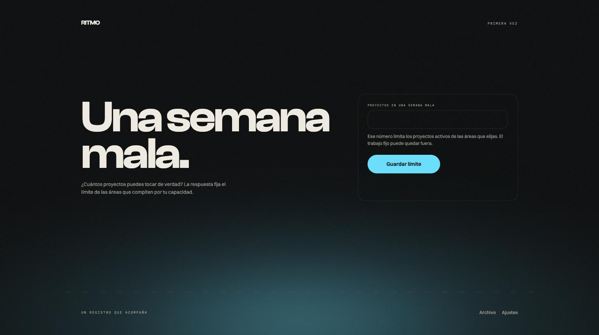
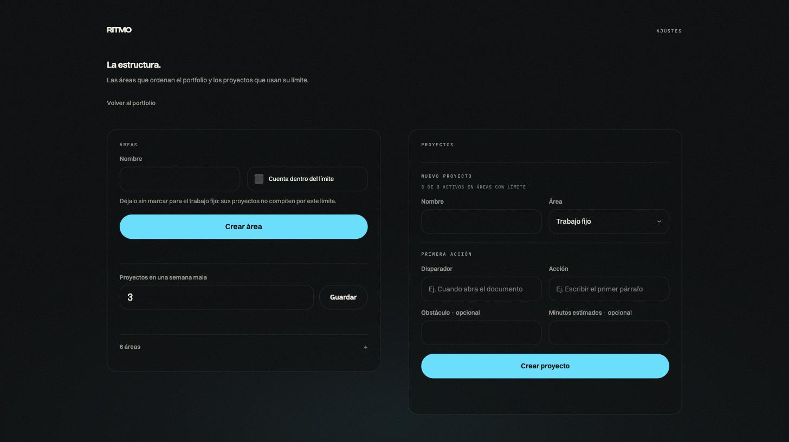
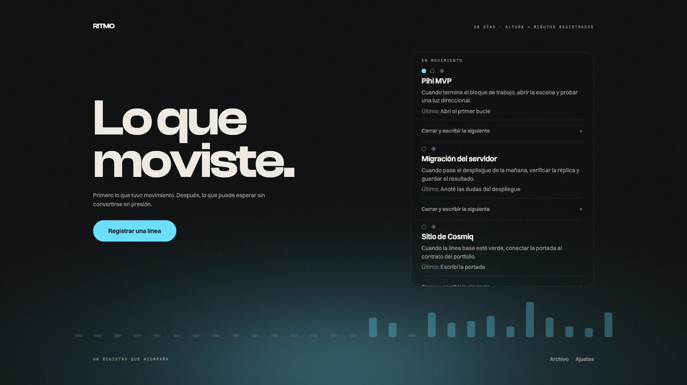
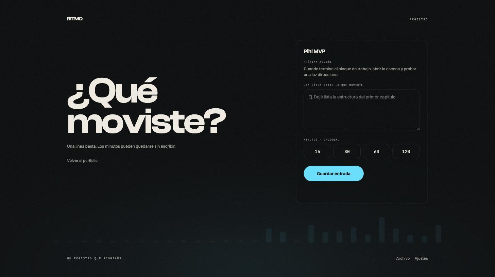

# Ritmo

Un registro de progreso para una sola persona, sobre todo lo que lleva en una vida — proyectos,
trabajo fijo, estudio, objetivos largos, viajes — **sin convertirse en otro calendario del que
quedarse atrás**.

Ritmo cambia planificar por registrar. El acto diario es anotar lo que de verdad se movió. Funciona
cuando puedes abrirlo después de una mala semana y ver progreso acumulado en vez de deuda acumulada,
y por eso lo sigues abriendo.

Corre **en tu máquina**. Tus datos son un archivo tuyo. No hay cuenta, no hay nube, no hay nadie más.

---

## Levantarlo

Necesitas Node. El proyecto fija la línea `24.20.0` en `package.json`.

```sh
npm ci               # instala contra el lockfile
npm run db:reset     # crea data/ritmo.sqlite y aplica las migraciones
npm run dev          # http://localhost:4321
```

Para usarlo de verdad, la versión compilada arranca más rápido:

```sh
npm run build
npm start            # http://localhost:4321
```

Eso es todo. `db:reset` **borra** la base y la recrea, así que se corre una vez al principio.

> Si quieres datos de ejemplo para mirar antes de meter los tuyos, `npm run seed` llena la base con
> un portafolio ficticio. No lo corras sobre tus datos reales.

---

## Primer arranque

Con la base vacía, Ritmo hace una sola pregunta.



**En una semana mala, ¿cuántos proyectos puedes tocar de verdad?**

No es la semana promedio: es la mala. Ese número se vuelve tu **límite activo** — cuántos proyectos
pueden estar activos a la vez en las áreas que compitan por tu capacidad. Ritmo no trae un número por
defecto a propósito; el que pongas sale de tu capacidad real, no de una constante que alguien eligió.

Después vas a **Ajustes** a crear tus áreas y tus proyectos.

---

## La estructura: áreas, proyectos y el límite



**Un área** es el nivel alto de tu portafolio: Trabajo fijo, Estudio, un estudio propio, un viaje.
Al crearla decides una sola cosa:

- **Cuenta dentro del límite** — el área compite por tu capacidad.
- **Sin marcar** — el trabajo fijo. Sus proyectos no compiten por ese límite, porque no elegiste
  tenerlos.

**Un proyecto** vive en un área y **nace con su primera acción**. Eso no es opcional: un proyecto sin
próxima acción es un proyecto que no sabes cómo continuar. La acción se escribe en dos partes:

| | |
|---|---|
| **Disparador** | la situación, no la hora — *"Cuando termine el bloque de trabajo"* |
| **Acción** | lo que harás — *"abrir la escena y probar una luz direccional"* |

Opcionalmente un **obstáculo** y unos **minutos estimados**.

**Si el límite está lleno**, el proyecto se crea archivado y Ritmo te dice el conteo, sin regañarte.
Los archivados siguen visibles en el portafolio.

---

## El día a día



`/` abre con **lo que tuvo movimiento**, primero. Después, lo que puede esperar. Cada proyecto muestra:

- **Las marcas** — un círculo lleno por cada avance registrado desde que abriste el plan actual, un
  círculo vacío para el paso siguiente, un rombo para el objetivo. Es un camino, no un puntaje.
- **La próxima acción**, leída como una frase.
- **Lo último** que registraste.

**El gráfico de fondo** son tus últimos 28 días (14 en móvil). La altura de cada marca son los
minutos registrados ese día. Un día sin nada es un trazo tenue; un día con algo escrito pero sin
minutos sube al piso mínimo; un día con minutos crece proporcional.

### Registrar



Tocas un proyecto y llegas al registro con **ese proyecto ya puesto** y su próxima acción a la vista
— para que actúes en vez de decidir. Escribes **una línea** sobre lo que moviste. Los minutos son
cuatro botones, `15 / 30 / 60 / 120`, y son **opcionales**: si tocas el que ya estaba puesto, se
suelta.

La confirmación es que la marca de hoy crece en el gráfico. No hay mensaje de felicitación.

### Cerrar una acción y escribir la siguiente

En cada proyecto del portafolio, **"Cerrar y escribir la siguiente"** cierra la acción actual y abre
su reemplazo en el mismo gesto. No se puede cerrar sin escribir la que sigue — un proyecto activo
siempre tiene exactamente un paso siguiente. La cerrada queda como historial.

---

## Lo que Ritmo no hace, a propósito

- **No hay rachas, puntos, insignias, niveles ni tablas.** El progreso es informativo, nunca
  evaluativo.
- **Nunca hay rojo, ni deuda, ni contadores de fallo.** Una semana en blanco no borra nada de lo que
  ya estaba.
- **No manda notificaciones**, ni recordatorios, ni correos de "te faltó X". Lo abres cuando lo abres.
- **No agenda horas.** Un disparador es una situación, no un hueco en el calendario.

---

## Tus datos

Viven en **`data/ritmo.sqlite`**, un archivo SQLite tuyo. Está en `.gitignore`, así que nunca sale
del repositorio.

> **Copiar el archivo en caliente no es un respaldo.** Con la app corriendo, un `cp` puede producir
> una copia corrupta. Para respaldar de verdad: detén el servidor, o usa `VACUUM INTO`.

Para trabajar contra otra base sin tocar la tuya:

```sh
RITMO_DB_PATH=/tmp/prueba.sqlite npm run db:reset
RITMO_DB_PATH=/tmp/prueba.sqlite npm run dev
```

---

## Todavía no existe

Ritmo está en construcción y estas piezas están especificadas pero sin construir:

| | |
|---|---|
| `/semana` | el ritual semanal: propuesta al abrir la semana, cierre al terminarla |
| `/p/:id` | detalle de un proyecto con su historial |
| `/archivo` | el respaldo de lo archivado, latente y cerrado |
| Objetivos | el nivel sobre los proyectos, y su estado latente |
| Compromisos | lo que te propones por semana, con reserva |
| Calibración | comparar lo estimado contra lo registrado |
| Autenticación | diseñada (`D-004`), sin construir — por eso corre solo en local |

---

## Para desarrollar

El proyecto sigue un arnés de desarrollo guiado por especificación. Empieza por `AGENTS.md`,
`STATUS.md` y `docs/project/`.

```sh
npm test                  # reglas del dominio, sin dependencias
npm run check:core        # la frontera entre capas, verificada
npm run typecheck         # astro check + tsc
npm run build             # compilación
npm run test:integration  # store y API contra un SQLite real
node scripts/harness-lint.mjs   # presupuestos y forma de los registros
```

Las cinco primeras son las puertas de calidad de `docs/project/quality-gates.md`. Cuatro
dependencias de runtime y cuatro de desarrollo, cada una justificada en `docs/decisions/`.
