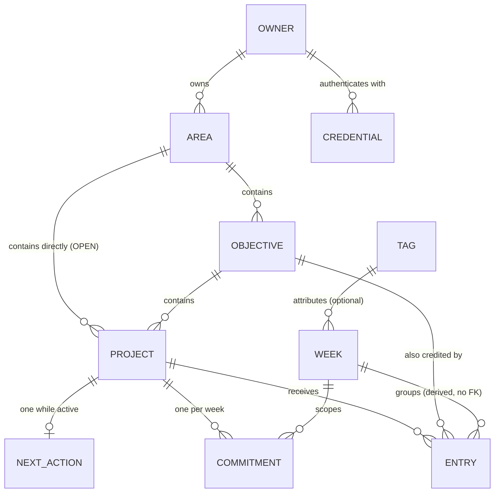
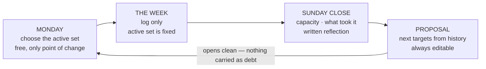

# Data Model

Derived from `brief.md` and traced to `requirements.json`. Where the brief does not settle
something, this file records it as **open** rather than giving it a default in passing.

## Structure

Two edges carry most of the design. `OBJECTIVE ||--o{ ENTRY` is the cross-area credit of FR-5: an
entry logged on a fixed-job project also advances a learning objective elsewhere. And there is no
target on `OBJECTIVE` at all (FR-2) — which is why an objective can go quiet without failing.

## The weekly cycle

## Entities

### Owner

Exactly one row today. It exists so ownership is explicit rather than implied, which NFR-3 requires
so that adding a second party later is additive instead of a migration.

| Field | Type | Required | Notes |
| --- | --- | --- | --- |
| id | string | yes | Stable identifier. |
| activeCap | integer | yes | Answered at first setup (FR-13). Never a shipped constant. |
| capRaises | list | yes | Each raise recorded with a date. The record is itself the signal. |

### Credential

*One WebAuthn passkey per device — phone, laptop, a spare. Stored because passkeys require it:
`D-004` keeps sessions stateless, but the credential itself has to persist somewhere.*

| Field | Type | Required | Notes |
| --- | --- | --- | --- |
| id | string | yes | |
| ownerId | string | yes | |
| label | string | yes | "iPhone", "laptop" — so a lost device can be revoked by name. |
| credentialId | string | yes | The WebAuthn credential identifier. Unique. |
| publicKey | string | yes | Verifies the signature. No secret is stored: the private key never leaves the device. |
| signCount | integer | yes | WebAuthn counter, checked to detect a cloned authenticator. |
| createdAt | timestamp | yes | |
| lastUsedAt | timestamp | no | |

### Area

*The top level of the portfolio — Fixed job, Study, Travel, Cosmiq Studio. One structure
for all of life; there is no work mode and personal mode.*

| Field | Type | Required | Notes |
| --- | --- | --- | --- |
| id | string | yes | |
| name | string | yes | e.g. Study, Fixed job, Travel. The area tree is the life portfolio (FR-1). |
| countsAgainstCap | boolean | yes | `false` for the fixed job, which has its own uncapped quota (FR-15). Generalised rather than a fixed-job flag. |

### Objective

*What you want to reach or learn — Iceland, the German visa, three.js. Defined as much by what
it lacks: no target column, no deadline, no reserve, which is why an objective cannot fail.*

Carries no target, no schedule and no reserve (FR-2).

| Field | Type | Required | Notes |
| --- | --- | --- | --- |
| id | string | yes | |
| areaId | string | yes | |
| title | string | yes | |
| type | enum | yes | `learning` \| `outcome` (FR-2, US-10). |
| horizon | date | no | A period, not a deadline. |
| why | text | yes | "Why this is mine" — the self-concordance check (research §13). |
| state | derived | — | See Derived values. Never written directly. |

### Project

*Where the target lives. The tangible, short-horizon thing — "Pihi MVP", "the wedding site".
Every commitment hangs here, never off an objective.*

| Field | Type | Required | Notes |
| --- | --- | --- | --- |
| id | string | yes | |
| areaId | string | yes | |
| objectiveId | string | **open** | Nullable or not — see Open decisions. |
| title | string | yes | |
| state | enum | yes | `active` \| `shelved` (FR-17). Mutable only on the week boundary (FR-14). |
| externalDeadline | date | no | Settable **only** when externally imposed (FR-16). Orders priority and protects the slot; generates no hour and no reminder. |
| deadlineSource | text | conditional | Required when `externalDeadline` is set — names who imposed it, which is what keeps self-imposed dates out. |

### Commitment

*What you promise for one specific week on one project. Always a frequency or a volume over the
week; never a slot on a clock.*

One per project per week. Whether it is stored per week or as a standing definition that
instantiates weekly is an open decision.

| Field | Type | Required | Notes |
| --- | --- | --- | --- |
| id | string | yes | |
| projectId | string | yes | |
| weekId | string | yes | |
| target | integer | yes | Frequency or volume over the week. Never a clock slot (FR-7). |
| proposedTarget | integer | no | What the adaptive proposal suggested, kept beside what the owner accepted (FR-10). Internal calibration signal only — never rendered as a comparison the owner has to answer for. |
| reserve | integer | yes | Defaults to `ceil(0.30 × target)`, minimum 1. |
| reserveSpent | derived | — | Count of `reserve_spend` entries in the week. |

### NextAction

*The single field that buys back mental quiet: writing a concrete plan removes an unfinished
task's cognitive intrusion as well as finishing it does. One **open** row per active project — closed
rows stay as the history FR-20 calibrates against. It is also the unit research §10 says to
decompose: the next stretch, never the whole project.*

| Field | Type | Required | Notes |
| --- | --- | --- | --- |
| id | string | yes | |
| projectId | string | yes | Exactly one per active project (FR-6). |
| trigger | text | yes | The "if" — a situation, not a time. |
| act | text | yes | The "then". |
| obstacle | text | no | Offered, never required (research §6). |
| estimateMinutes | integer | no | What you think it will take, captured when you write the action. Half of FR-20. |
| createdAt | timestamp | yes | Opens the window used to derive the actual. |
| closedAt | timestamp | no | Null while current. Exactly one open row per active project; the rest are history. |

### Entry

*The log. The table that grows fastest and the one that must cost seconds — everything else in
this model is scaffolding so that this one gets filled.*

The central write path (FR-4). Must cost seconds (NFR-1).

| Field | Type | Required | Notes |
| --- | --- | --- | --- |
| id | string | yes | |
| kind | enum | yes | `progress` \| `reserve_spend`. Spending a reserve is an event, not a decremented counter (FR-8). |
| projectId | string | yes | |
| creditsObjectiveId | string | no | An objective in **any** area, including another one (FR-5). |
| occurredAt | timestamp | yes | Also decides which week the entry belongs to — the week is derived from the date, and there is deliberately **no `weekId` column** to drift out of step with it. Requires an index on `(projectId, occurredAt)`. |
| what | text | yes | |
| effortMinutes | integer | no | For calibration only, never for billing. |
| note | text | no | |

### Week

*The only period that exists. No days, no months, no quarters. A week opens, fills with entries,
and closes — and closing carries nothing forward.*

| Field | Type | Required | Notes |
| --- | --- | --- | --- |
| id | string | yes | |
| startsOn | date | yes | The week is the only period. The close writes the three fields below (FR-11). |
| capacityLabel | enum | no | `light` \| `normal` \| `heavy`, applied retroactively at close (FR-9). Absent is valid and still trains on inference. |
| tagId | string | no | What took the week (FR-12). One optional tap. |
| reflection | text | no | Short and written (research §17). |
| closedAt | timestamp | no | Null until closed. |

### Tag

*Owner-created labels for week attribution. They do not ship as a fixed list, and that is the
point: the pattern only appears because you named it, which is what keeps autonomy intact.*

Owner-defined labels for week attribution — work, leisure, the unexpected, people, health.

| Field | Type | Required | Notes |
| --- | --- | --- | --- |
| id | string | yes | |
| label | string | yes | Created by the owner, never shipped as a fixed list. |

## Derived values

Never stored, always computed, so they cannot drift from the log.

- **Objective state** — `active` while a live project sits under it; `dormant` after four weeks with
  none; `shelved` when the owner shelved it. Dormancy is not failure (FR-3).
- **Stale rate** — share of active projects with zero entries in a period. Audits the active cap.
- **Consistency** — a ratio over a period ("3 of the last 4 weeks had progress"). Never a
  consecutive-day count, which a single miss could zero (FR-18).
- **Week attribution pattern** — the distribution of `Week.tagId` across roughly eight weeks. No
  duration is ever computed for anything outside a project (NFR-8).
- **Actual against estimate** — for a closed `NextAction`, the actual is the sum of
  `Entry.effortMinutes` on its project between `createdAt` and `closedAt`. *Assumption:* effort
  logged on the project in that window belongs to that next action. It is an approximation, taken
  deliberately so that no extra field has to be filled at logging time (NFR-1). The calibration
  factor is actual ÷ estimate across the **last 20 closed actions**, not the whole history. Bounded
  for two reasons: the 10 ms CPU ceiling of `D-001` applies to every render, and how you estimated
  two years ago says nothing about how you estimate now. Twenty is a starting value.
- **Proposal drift** — `target` against `proposedTarget` across weeks. Systematically cutting the
  proposal means the model is reading capacity too high, which it cannot otherwise learn because it
  only ever sees the accepted number (FR-10).

## Validation rules

- `externalDeadline` requires `deadlineSource`. A date with no external source is rejected.
- `Project.state` transitions only on a week boundary; within a week the active set is immutable.
- The count of active projects in areas where `countsAgainstCap` is true must not exceed
  `Owner.activeCap` without a recorded cap raise.
- An active project must have exactly one `NextAction` with `closedAt` null.
- `reserve >= 1` on every commitment.
- No entity stores a duration for anything that is not an `Entry` on a project.
- No entity stores a start time, a clock slot, or a calendar event.
- Referential actions: `NextAction` and `Commitment` cascade from `Project` — neither means anything
  without it. `Entry` **restricts**: a project carrying history cannot be deleted, which is the
  retention rule below expressed as a constraint rather than as a convention.

## Data lifecycle

- **Week rollover.** Closing a week freezes it. Nothing missed is copied forward: no debt field
  exists to copy it into (FR-19).
- **Shelving.** Reversible, keeps history and stays visible in the portfolio. Distinct from deleting.
- **Retention.** The log is the product; entries are never pruned automatically.
- **Export.** A plain-text weekly summary the owner can copy out is the only sharing affordance, and
  it is a rendering over existing data, not stored state.

## Open decisions

1. **Is `Project.objectiveId` nullable?** A fixed-job project such as a server migration has no
   objective above it. Surfaced by drawing the structure. Also in `brief.md` § Open Questions.
2. **Is a commitment stored per week, or as a standing definition instantiated weekly?** Per week is
   simpler to reason about; standing is less to re-enter. Undecided.
3. **The reserve tuning band.** The spend range at which the adaptive proposal should move the target
   is not chosen, and no value is assumed anywhere.
4. **Identity and storage.** `id` types, primary keys and persistence all wait on the `runtime`,
   `data` and `identity` foundation decisions, which are still unsettled.

## Requirement coverage

Not every requirement has a data footprint, and that is correct rather than a gap. `NFR-4` through
`NFR-6` are deployment and interface constraints; `NFR-7`, `NFR-9` and `NFR-10` are rules about what
the product must *not* do or must not render, and a rule of absence has no table. `NFR-2` and `NFR-3`
are carried by the `Owner` entity existing at all. Everything in `requirements.json` that describes
stored state is traced from a table above.
