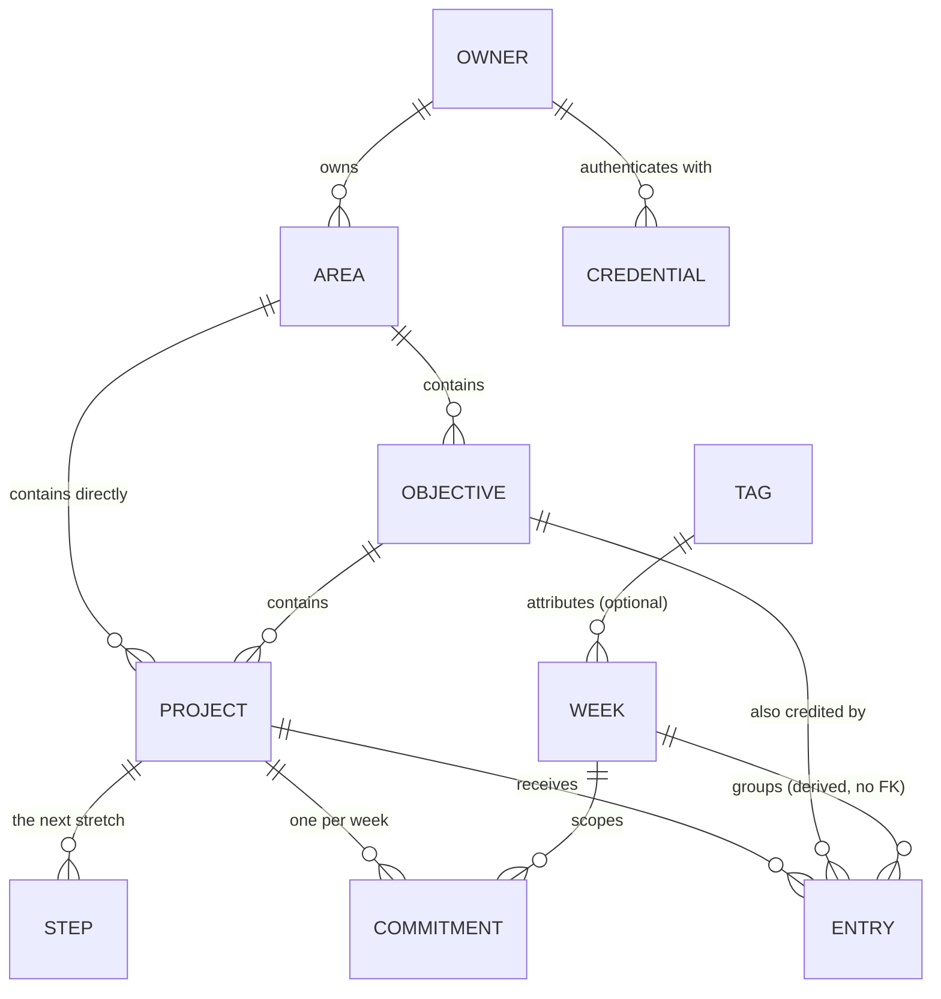
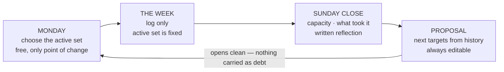

# Data Model

Derived from `brief.md` and traced to `requirements.json`. Where the brief does not settle
something, this file records it as **open** rather than giving it a default in passing.

Every `id` below is a ULID stored as `TEXT`, generated through the `IdGen` port (`D-011`).

## Structure

Two edges carry most of the design. `OBJECTIVE ||--o{ ENTRY` is the cross-area credit of FR-5: an
entry logged on a fixed-job project also advances a learning objective elsewhere. And there is no
target on `OBJECTIVE` at all (FR-2) — which is why an objective can go quiet without failing.

## The weekly cycle

## Entities

### Owner

Exactly one row today. It exists so ownership is explicit rather than implied, which NFR-3 requires
so that adding a second party later is additive instead of a migration.

| Field | Type | Required | Notes |
| --- | --- | --- | --- |
| id | string | yes | Stable identifier. |
| activeCap | integer | yes | Answered at first setup (FR-13). Never a shipped constant. |
| capRaises | list | yes | Each raise recorded with a date. The record is itself the signal. |

### Credential

*One WebAuthn passkey per device — phone, laptop, a spare. Stored because passkeys require it:
`D-004` keeps sessions stateless, but the credential itself has to persist somewhere.*

| Field | Type | Required | Notes |
| --- | --- | --- | --- |
| id | string | yes | |
| ownerId | string | yes | |
| label | string | yes | "iPhone", "laptop" — so a lost device can be revoked by name. |
| credentialId | string | yes | The WebAuthn credential identifier. Unique. |
| publicKey | string | yes | Verifies the signature. No secret is stored: the private key never leaves the device. |
| signCount | integer | yes | WebAuthn counter, checked to detect a cloned authenticator. |
| createdAt | timestamp | yes | |
| lastUsedAt | timestamp | no | |

### Area

*The top level of the portfolio — Fixed job, Study, Travel, Cosmiq Studio. One structure
for all of life; there is no work mode and personal mode.*

| Field | Type | Required | Notes |
| --- | --- | --- | --- |
| id | string | yes | |
| name | string | yes | e.g. Study, Fixed job, Travel. The area tree is the life portfolio (FR-1). |
| countsAgainstCap | boolean | yes | `false` for the fixed job, which has its own uncapped quota (FR-15). Generalised rather than a fixed-job flag. |

### Objective

*What you want to reach or learn — Iceland, the German visa, three.js. Defined as much by what
it lacks: no target column, no deadline, no reserve, which is why an objective cannot fail.*

Carries no target, no schedule and no reserve (FR-2).

| Field | Type | Required | Notes |
| --- | --- | --- | --- |
| id | string | yes | |
| areaId | string | yes | |
| title | string | yes | |
| type | enum | yes | `learning` \| `outcome` (FR-2, US-10). |
| horizon | date | no | A period, not a deadline. |
| why | text | yes | "Why this is mine" — the self-concordance check (research §13). |
| state | derived | — | See Derived values. Never written directly. |

### Project

*Where the target lives. The tangible, short-horizon thing — "Pihi MVP", "the wedding site".
Every commitment hangs here, never off an objective.*

| Field | Type | Required | Notes |
| --- | --- | --- | --- |
| id | string | yes | |
| areaId | string | yes | |
| objectiveId | string | no | **Nullable** (2026-08-30). A fixed-job project such as a server migration has no objective above it; `areaId` stays required, so the area is the mandatory grouping and the objective is optional. A synthetic "no objective" row was rejected: it is the over-organizing the product exists to avoid, and it would sit permanently `dormant` and pollute the objective view. Independent of FR-5 — a project with no objective can still credit one through `Entry.creditsObjectiveId`. |
| title | string | yes | |
| state | enum | yes | `active` \| `shelved` (FR-17). Mutable only on the week boundary (FR-14), and not at all once finished — `state` is the commitment, not the outcome. |
| finishedAt | timestamp | no | When the owner said it ended (FR-23). Not a third `state`: completion is a timestamp throughout this model, and `ALTER TABLE ADD COLUMN` avoided rebuilding this table against its four foreign keys. Settable any day, reversible to null, and the project returns to `shelved` when it is (`D-025`). |
| externalDeadline | date | no | Settable **only** when externally imposed (FR-16). Orders priority and protects the slot; generates no hour and no reminder. |
| deadlineSource | text | conditional | Required when `externalDeadline` is set — names who imposed it, which is what keeps self-imposed dates out. |

### Commitment

*What you promise for one specific week on one project. Always a frequency or a volume over the
week; never a slot on a clock.*

One per project per week — **stored per week, presented as standing** (2026-08-30). A standing
definition cannot carry FR-10: `proposedTarget` sits beside `target`, and that is a pair *per week*,
so a single standing row has nowhere to keep what was proposed each week and proposal drift becomes
uncomputable. It would also break the freeze — closing a week freezes it, and editing a standing
commitment in March would retroactively change what January meant. The "less to re-enter" argument
is met in the interface instead: opening a week pre-fills from the week before, which FR-10 already
requires.

| Field | Type | Required | Notes |
| --- | --- | --- | --- |
| id | string | yes | |
| projectId | string | yes | |
| weekId | string | yes | |
| target | integer | yes | Frequency or volume over the week. Never a clock slot (FR-7). |
| unit | enum | yes | `times` \| `minutes` — which of the two `target` counts. Without it neither the close nor FR-10's proposal can read the number (D-030). |
| proposedTarget | integer | no | What the adaptive proposal suggested, kept beside what the owner accepted (FR-10). Internal calibration signal only — never rendered as a comparison the owner has to answer for. |
| reserve | integer | yes | Defaults to `ceil(0.30 × target)`, minimum 1. |
| reserveSpent | derived | — | Count of `reserve_spend` entries in the week. |

### Step

*Writing a concrete plan removes an unfinished task's cognitive intrusion as well as finishing it
does (§5), and this list is that plan. It is the unit research §10 says to decompose — the next
stretch, never the whole project. `D-024` replaced the single if–then next action with a list after
weeks of real use showed the trigger, a moment the day had to hit, was what stopped the logging.
The `trigger` and `obstacle` fields left with it: both came from §6, which `D-024` overrides.*

| Field | Type | Required | Notes |
| --- | --- | --- | --- |
| id | string | yes | |
| projectId | string | yes | Many per project, bounded to the next stretch (FR-6). Ordered by `createdAt`; no order field, because a list that needs sorting is already too long. |
| title | text | yes | What you will do. The only thing typed. |
| estimateMinutes | integer | no | What you think it will take. Half of FR-20. |
| markedFor | date | no | The day the owner said they would do it (FR-22). Read **only** when it equals today: a past value is not history, is never counted or rendered, and is cleared without record. Never an hour, never a duration. |
| createdAt | timestamp | yes | Opens the window used to derive the actual. |
| doneAt | timestamp | no | Null while open. Closes the window. |

### Entry

*The log. The table that grows fastest and the one that must cost seconds — everything else in
this model is scaffolding so that this one gets filled.*

The central write path (FR-4). Must cost seconds (NFR-1).

| Field | Type | Required | Notes |
| --- | --- | --- | --- |
| id | string | yes | |
| kind | enum | yes | `progress` \| `reserve_spend`. Spending a reserve is an event, not a decremented counter (FR-8). |
| projectId | string | yes | |
| creditsObjectiveId | string | no | An objective in **any** area, including another one (FR-5). |
| occurredAt | timestamp | yes | Also decides which week the entry belongs to — the week is derived from the date, and there is deliberately **no `weekId` column** to drift out of step with it. Requires an index on `(projectId, occurredAt)`. |
| what | text | yes | |
| effortMinutes | integer | no | For calibration only, never for billing. |
| stepId | string | no | The step this effort belongs to, fixed when the entry was written (`D-027`). Null when no single step of the project was marked that day — ambiguity records nothing rather than splitting minutes it cannot divide. Never set afterwards: marking a step later does not reach back, which is what keeps `FR-22`'s expiry intact. |
| note | text | no | |

### Week

*The only period that exists. No days, no months, no quarters. A week opens, fills with entries,
and closes — and closing carries nothing forward.*

| Field | Type | Required | Notes |
| --- | --- | --- | --- |
| id | string | yes | |
| startsOn | date | yes | A Monday on the **local** calendar, through `calendarDateOf` — one idea of what day it is, shared with the day list. An entry belongs to the week holding its local `occurredAt` date, so one written at 00:30 on Monday about Sunday's work belongs to the new week (D-030). The close writes the three fields below (FR-11). |
| capacityLabel | enum | no | `light` \| `normal` \| `heavy`, applied retroactively at close (FR-9). Absent is valid and still trains on inference. |
| tagId | string | no | What took the week (FR-12). One optional tap. |
| reflection | text | no | Short and written (research §17). |
| closedAt | timestamp | no | Null until closed. A week the owner never closes closes itself when the next Monday arrives, leaving `capacityLabel`, `tagId` and `reflection` null — NFR-8 already holds an untagged week as complete, so nothing is owed (FR-19, D-030). Whatever performs it must be idempotent: two opens of the app on a Monday must not close the week twice. |

### Tag

*Owner-created labels for week attribution. They do not ship as a fixed list, and that is the
point: the pattern only appears because you named it, which is what keeps autonomy intact.*

Owner-defined labels for week attribution — work, leisure, the unexpected, people, health.

| Field | Type | Required | Notes |
| --- | --- | --- | --- |
| id | string | yes | |
| label | string | yes | Created by the owner, never shipped as a fixed list. |

## Derived values

Never stored, always computed, so they cannot drift from the log.

- **Objective state** — `active` while a live project sits under it; `dormant` after four weeks with
  none; `shelved` when the owner shelved it. Dormancy is not failure (FR-3).
- **Stale rate** — share of active projects with zero entries in a period. Audits the active cap.
- **Consistency** — a ratio over a period ("3 of the last 4 weeks had progress"). Never a
  consecutive-day count, which a single miss could zero (FR-18).
- **Week attribution pattern** — the distribution of `Week.tagId` across roughly eight weeks. No
  duration is ever computed for anything outside a project (NFR-8).
- **Actual against estimate** — for a done `Step`, the actual is the sum of
  `Entry.effortMinutes` on the entries whose `stepId` is that step. Exact, not approximated:
  `D-027` replaced the open-window derivation, which `D-024` broke the moment a project could hold
  several open steps and their windows overlapped. Attribution happens when the entry is written
  and nothing is typed twice (NFR-1); a step nothing points at reads zero, which is the truth
  rather than a gap to fill. The calibration
  factor is actual ÷ estimate across the **last 20 done steps**, not the whole history. Bounded
  for two reasons: the 10 ms CPU ceiling of `D-001` applies to every render, and how you estimated
  two years ago says nothing about how you estimate now. Twenty is a starting value.
- **Proposed target** — **in conflict as of 2026-09-22, do not implement either half yet.**
  `D-030` §2 says the median of what was achieved over the last four closed weeks. The rule below
  was confirmed by the owner on 2026-08-30 and `D-030` replaced it without citing it, because the
  Planner wrote `D-030` without reading this section. The owner decides which stands (`D-029`).
  Over the **last two closed weeks**: reserve untouched in both proposes
  `target + 1`; reserve exhausted in both proposes `target - 1`; anything else proposes the same
  target. Never below 1. *Chosen by the assistant, confirmed by the owner 2026-08-30.* A percentage
  band was rejected because it collapses on small integers: at `target = 3` the reserve is 1, so the
  fraction spent can only be 0 or 1 and the target would oscillate every week. Requiring the signal
  to repeat across two weeks is what makes it stable. Always a proposal, always editable (FR-10).
- **Proposal drift** — `target` against `proposedTarget` across weeks. Systematically cutting the
  proposal means the model is reading capacity too high, which it cannot otherwise learn because it
  only ever sees the accepted number (FR-10).

## Validation rules

- `externalDeadline` requires `deadlineSource`. A date with no external source is rejected.
- **A project with `finishedAt` set is not counted against `Owner.activeCap`.** It is not carried,
  so it does not hold a slot (`D-025`). Every reading of the cap must exclude it; a miss here is
  invisible, because it widens the cap rather than breaking anything.
- `Project.state` cannot change while `finishedAt` is set. Reopen it first.
- `Project.state` transitions only on a week boundary; within a week the active set is immutable.
- The count of active projects in areas where `countsAgainstCap` is true must not exceed
  `Owner.activeCap` without a recorded cap raise.
- A `Step` carries `markedFor` for at most one day at a time, and only a project that is `active`
  in the current week may have a step marked. No rule caps how many are marked: `Owner.activeCap`
  is the only cap (FR-22, FR-13).
- No `Step` field stores an hour, a duration or a condition that has to be met before doing it.
- `reserve >= 1` on every commitment.
- No entity stores a duration for anything that is not an `Entry` on a project.
- No entity stores a start time, a clock slot, or a calendar event.
- Referential actions: `Step` and `Commitment` cascade from `Project` — neither means anything
  without it. `Entry` **restricts**: a project carrying history cannot be deleted, which is the
  retention rule below expressed as a constraint rather than as a convention.

### Retired: NextAction

*`D-024` replaced NextAction with `Step`; `T-021` removed its last reader. Migration
`0005_drop_next_actions.sql` removes the retired table, indexes and constraints (`T-031`,
`D-028`). The owner confirmed the retained rows were disposable test data, including the
closed action that migration 0002 did not carry across. Historical migrations remain intact
for ordered upgrades. A guard test in `test/core/page-layout.test.ts` keeps application code
from reading or writing next actions again.*

## Data lifecycle

- **Week rollover.** Closing a week freezes it. Nothing missed is copied forward: no debt field
  exists to copy it into (FR-19).
- **Day rollover.** A `markedFor` date that is not today is dead the moment the day turns. Nothing
  reads it, nothing counts what went undone, and clearing it is not an event (FR-22). It is the
  week-rollover rule at a day's scale: there is no debt field to copy it into.
- **Shelving.** Reversible, keeps history and stays visible in the portfolio. Distinct from deleting.
- **Retention.** The log is the product; entries are never pruned automatically.
- **Sharing.** A plain-text weekly summary the owner can copy out is the only sharing affordance,
  and it is a rendering over existing data, not stored state.
- **Export.** Separately, FR-21 hands the owner the whole database as a downloadable SQLite file —
  the condition on which the privacy constraint was reversed (`D-005`). Also a rendering, not stored
  state, but of everything rather than of one week.

## Settled decisions

All four decisions this file carried as open were settled with the owner on 2026-08-30.

1. **`Project.objectiveId` is nullable.** See the `Project` table.
2. **A commitment is stored per week and presented as standing.** See the `Commitment` table.
3. **The proposed target moves on a two-week signal, not a percentage band.** See Derived values.
4. **Ids are ULIDs stored as `TEXT`, generated behind a port.** `D-011`.

One question in `brief.md` § Open Questions still touches this file: whether `estimateMinutes` is
required. It is modelled here as optional, on a `Step` rather than on the retired next action, and
stays an assumption until the brief records it. `D-024` kept the field deliberately: the
calibration it feeds is unbuilt, and this is an MVP — absent today is not absent for good.

## Requirement coverage

Not every requirement has a data footprint, and that is correct rather than a gap. `NFR-4` through
`NFR-6` are deployment and interface constraints; `NFR-7`, `NFR-9` and `NFR-10` are rules about what
the product must *not* do or must not render, and a rule of absence has no table. `NFR-2` and `NFR-3`
are carried by the `Owner` entity existing at all. Everything in `requirements.json` that describes
stored state is traced from a table above.
